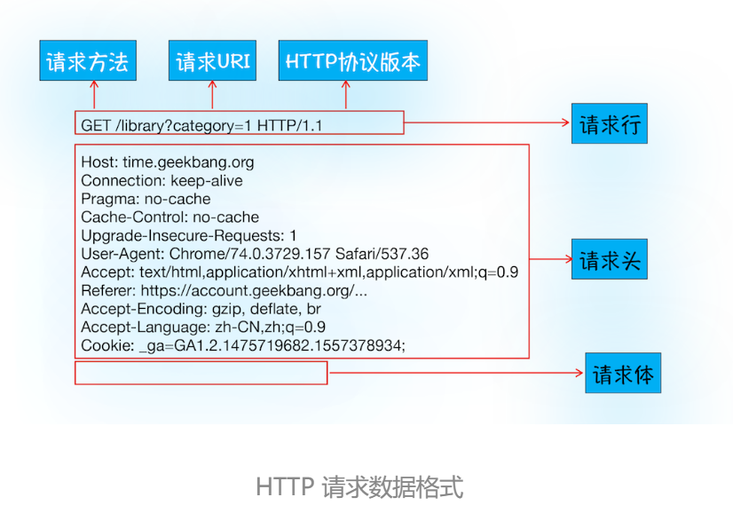
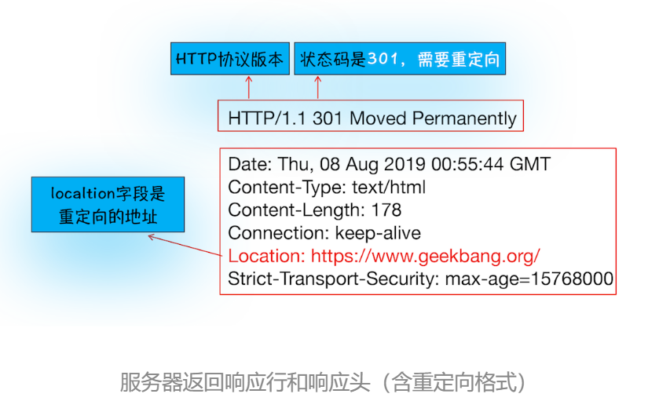
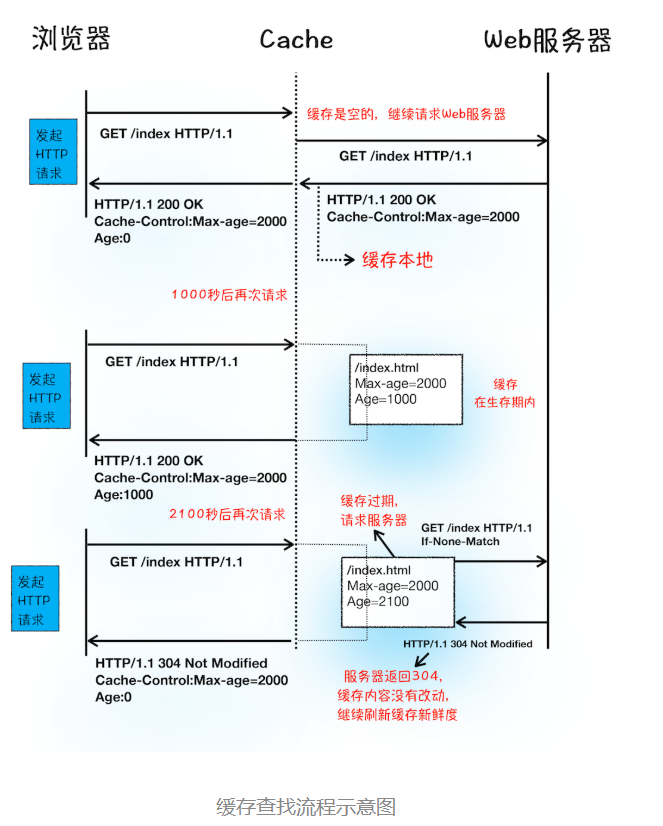
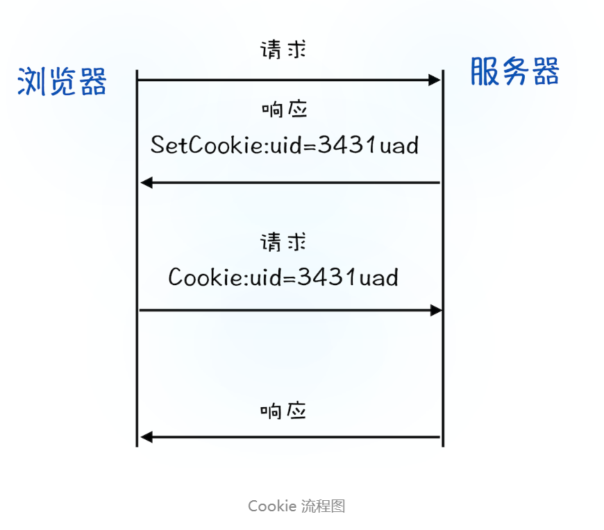
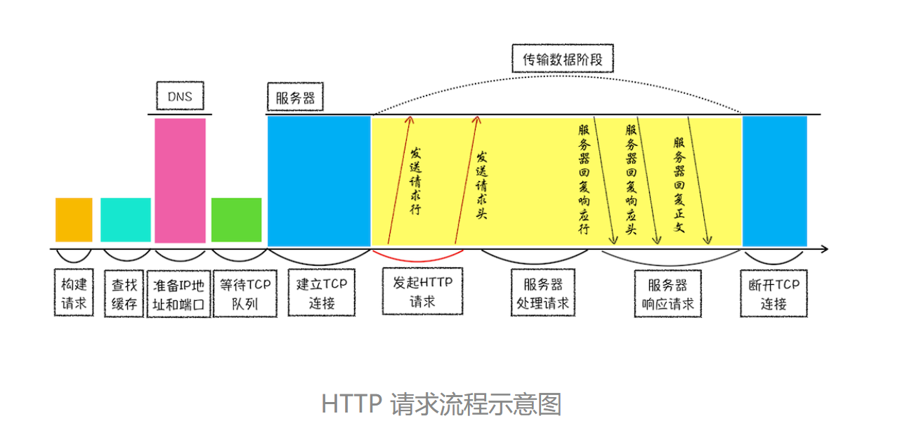

# HTTP请求流程：为什么很多站点第二次打开速度会很快？
HTTP是一种允许浏览器向服务器获取资源的协议，是Web的基础，通常由浏览器发起请求，用来获取不同类型的文件。  

## 浏览器端发起HTTP请求流程
- 构建请求
- 查找缓存
- 准备IP地址和端口
- 等待TCP队列
- 建立TCP连接
- 发送HTTP请求

### 1.构建请求
浏览器构建请求行信息
```
GET /index.html HTTP1.1
```
### 2.查找缓存
在真正发起网络请求之前，浏览器会先在浏览器缓存中查询是否有要请求的文件。其中，浏览器缓存是一种在本地保存资源副本，以供下次请求时直接使用的技术。

### 3.准备IP地址和端口
浏览器使用HTTP协议作为应用层协议，用来封装请求的文本信息；并使用TCP/IP作为传输层协议将它发到网络上。  
HTTP的内容是通过TCP的传输数据阶段来实现的。  
  
    
     
- HTTP网络请求第一步：和服务器建立TCP连接
- 建立TCP连接的第一步是准备IP地址和端口号
- 浏览器请求DNS返回域名对应的IP

DNS(Domain Name System),负责域名和IP的映射关系

### 4.等待TCP队列
Chrome有个机制，同一个域名同时最多只能建立6个TCP连接。

### 5.建立TCP连接
### 6.发送HTTP请求
  
  
- 请求行：请求方法(GET、POST)、请求URI(Uniform Resource Identifier)和HTTP版本协议
- 请求头：把浏览器的一些基础信息告诉服务器
- 请求体：提供POST需要的数据

## 服务器端处理HTTP请求流程
- 返回请求
- 断开连接
- 重定向

### 1.返回请求
  

- 状态码200，表示处理成功
- 404，没有找到页面

### 2.断开连接
如果浏览器或者服务器在其头信息中加入：
```
Connection:Keep-Alive
```
那么TCP连接在发送后将仍然保持打开状态，这样浏览器就可以继续通过同一个TCP连接发送请求。
### 3.重定向
  
状态301告诉浏览器需要进行重定向  
重定向网址包含在响应头的Locaton字段中，浏览器根据该地址进行跳转。

## 为什么很多站点第二次打开速度会很快？
- DNS缓存
- 页面资源缓存

  

- 当服务器返回HTTP响应头给浏览器时，浏览器是通过响应头中的**Cache-Control**字段来设置是否缓存该资源。
- Cache-Control中Max-age来设置一个缓存过期时长
  ```
  Cache-Control:Max-age=2000
  ```
- 如果缓存过期，浏览器则会继续发起网络请求，在HTTP请求头上
  ```
  If-None-Match:"4f80f-13c-3a1xb12a"
  ```
  服务器收到请求头后，会根据If-None-Match的值来判断请求的资源是否更新。
  - 如果没有更新，返回304状态码
  - 如果更新，服务器就直接返回最新资源给浏览器

## 登录状态是如何保持的？
- 服务器会在Set-Cookie中保存表示用户身份的字符串
  ```
  Set-Cookie:UID=3431uad;
  ```
- 浏览器将保存的Cookie数据写入请求头中的Cookie字段里
  ```
  Cookie:UID=3431uad;
  ```  

  
如果服务器端发送的响应头内有Set-Cookie的字段，那么浏览器会将其保存到本地。之后向服务器发送请求时，会自动在请求头中加入Cookie值，服务器会根据收到的Cookie去检查是哪个客户端发来的连接请求，然后对比服务器上的记录，最后得到该用户的状态信息。  

## 总结
  

- 构建请求
- 查找缓存
- 准备IP和端口
- 等待TCP队列
- 建立TCP队列
- 发起HTTP请求
- 服务器处理请求
- 服务器返回请求和断开连接