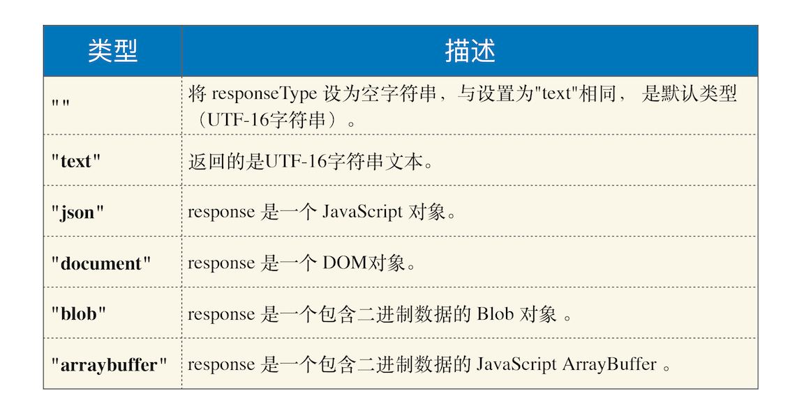

# webAPI：XMLHttpRequest是怎么实现的
XMLHttpRequest提供了从web服务器获取数据的能力，如果要更新某条数据，只需要通过XMLHttpRequest请求服务器提供的接口，就可以获取到服务器的数据，然后再操作DOM来更新内容，整个过程只需要更新网页的一部分就行了，不需要刷新整个页面。

## 回调函数 VS 系统调用栈
将一个函数作为参数传递给另外一个函数，那作为参数的这个函数就是**回调函数**
```
let callback = function(){
    console.log('i am do homework')
}
function doWork(cb) {
    console.log('start do work')
    cb()
    console.log('end do work')
}
doWork(callback)

```
回调函数callback是在主函数doWork返回之前执行的，这个回调过程称为**同步回调**  

```
let callback = function(){
    console.log('i am do homework')
}
function doWork(cb) {
    console.log('start do work')
    setTimeout(cb,1000)   
    console.log('end do work')
}
doWork(callback)

```
这种回调函数在主函数外部执行的过程称为**异步回调**

### 系统调用栈
**消息队列和主线程循环机制保证了页面有条不紊地运行**  
当循环系统执行一个任务的时候，都要为这个任务维护一个**系统调用栈**  

  

整个Parse HTML是一个完整的任务，在执行过程中的脚本解析、样式解析都是该任务的子过程，其下拉的长条就是执行过程中调用栈的信息。  

每个任务在执行过程中都有自己的调用栈，同步回调就是在当前主函数的上下文中执行回调函数  

异步回调是指回调函数在主函数以外执行，一般有两种方式：  
- 把异步函数做成一个任务，添加到消息队列尾部
- 把异步函数添加到微任务队列中，这样就可以在当前任务的末尾处执行微任务


## XMLHttpRequest运行机制
   


渲染进程将请求发送给网络进程，网络进程负责资源的下载，等网络进程接收到数据之后，利用IPC来通知渲染进程；渲染进程接收到消息后，将xhr的回调函数封装成任务添加到消息队列中，等主线程循环系统执行到该任务时，根据相应的状态来调用对应的回调函数。

```
 function GetWebData(URL){
    /**
     * 1: 新建 XMLHttpRequest 请求对象
     */
    let xhr = new XMLHttpRequest()

    /**
     * 2: 注册相关事件回调处理函数 
     */
    xhr.onreadystatechange = function () {
        switch(xhr.readyState){
          case 0: // 请求未初始化
            console.log(" 请求未初始化 ")
            break;
          case 1://OPENED
            console.log("OPENED")
            break;
          case 2://HEADERS_RECEIVED
            console.log("HEADERS_RECEIVED")
            break;
          case 3://LOADING  
            console.log("LOADING")
            break;
          case 4://DONE
            if(this.status == 200||this.status == 304){
                console.log(this.responseText);
                }
            console.log("DONE")
            break;
        }
    }

    xhr.ontimeout = function(e) { console.log('ontimeout') }
    xhr.onerror = function(e) { console.log('onerror') }

    /**
     * 3: 打开请求
     */
    xhr.open('Get', URL, true);// 创建一个 Get 请求, 采用异步


    /**
     * 4: 配置参数
     */
    xhr.timeout = 3000 // 设置 xhr 请求的超时时间
    xhr.responseType = "text" // 设置响应返回的数据格式
    xhr.setRequestHeader("X_TEST","time.geekbang")

    /**
     * 5: 发送请求
     */
    xhr.send();
}

```

1. 创建XMLHttpRequest对象
2. 为xhr对象注册回调函数
3. 配置基础的请求消息
4. 发起请求

### 1. 创建XMLHttpRequest对象
```
let xhr = new XMLHttpRequest()
```
### 2. 为xhr对象注册回调函数
因为网络请求比较耗时，所以要注册回调函数，这样后台任务执行完成之后就会通过调用回调函数来告诉其执行结果。  

- ontimeout,用来监控超时请求，如果后台请求超时了，该函数就会被调用
- onerror，用来监控出错信息，如果后台请求出错了，该函数会被调用
- onreadystatechange,用来监控后台请求过程中的状态，比如可以监控到HTTP头加载完成的消息、HTTP响应体消息以及数据加载完成的消息等。

### 3. 配置基础的请求消息
- open接口设置请求的地址、请求方法(get、post)和请求方式(同步或异步)
- xhr.timeout配置超时时间
- xhr.responseType配置服务器返回的格式


### 4. 发起请求
- xhr.send发起网络请求
- 如果网络请求出错了，执行xhr.onerror
- 如果超时了，执行xhr.ontimeout
- 如果是正常的数据接收，执行onreadystatechange来反馈相应的状态


## XMLHttpRequest使用过程中的”坑“

### 1.跨域问题
**跨域**：在A站点中去访问不同源的B站点的内容(比如，在www.geekbang.org要去请求time.geekbang.org中的内容)

```
var xhr = new XMLHttpRequest()
var url = 'https://time.geekbang.org/'
function handler() {
    switch(xhr.readyState){
        case 0: // 请求未初始化
        console.log(" 请求未初始化 ")
        break;
        case 1://OPENED
        console.log("OPENED")
        break;
        case 2://HEADERS_RECEIVED
        console.log("HEADERS_RECEIVED")
        break;
        case 3://LOADING  
        console.log("LOADING")
        break;
        case 4://DONE
        if(this.status == 200||this.status == 304){
            console.log(this.responseText);
            }
        console.log("DONE")
        break;
    }
}
   
function callOtherDomain() {
  if(xhr) {    
    xhr.open('GET', url, true)
    xhr.onreadystatechange = handler
    xhr.send();
  }
}
callOtherDomain()

```

### 2.HTTPS混合内容的问题
HTTPS混合内容是HTTPS页面中包含了不符合HTTPS安全要求的内容，比如包含了HTTP资源，通过HTTP加载的图像、视频、样式表、脚本等，都属于混合内容。