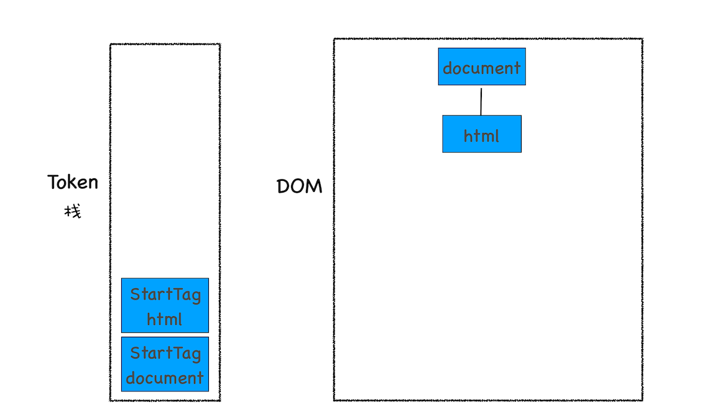
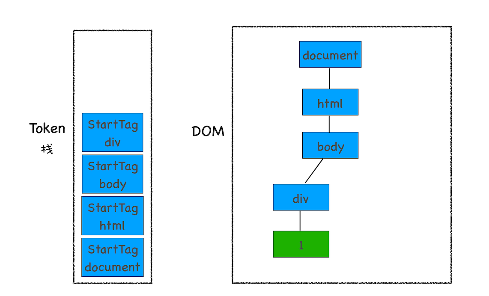

# DOM树：JS如何影响DOM树构建的
## 什么是DOM
- 从页面的视角来看，DOM是生成页面的基础数据结构
- 从JS脚本视角来看，DOM提供给JS脚本操作的接口，通过接口，JS可以对DOM结构进行访问，从而改变文档的结构、样式和内容
- 从安全视角来看，DON是一道安全防护线，一些不安全的内容在DOM解析阶段被拒之门外

## DOM树如何生成
**HTML解析器(HTMLParser)**:负责将HTML字节流转换为DOM结构。  

HTML解析器并不是等整个文档加载完成之后再解析的，而是**网络进程加载了多少数据，HTML解析器便解析多少数据**  
具体流程：网络进程根据响应头中的content-type判断文件类型，然后选择或创建一个渲染进程，**网络进程和渲染进程之间会建立一个共享数据的管道**，网络进程接收字节流，通过管道传递给渲染进程的HTML解析器，解析为DOM

### 字节流转换
  

1. 通过分词器将字节流转换为Token  
   - Tag Token  
     - StartTag
     - EndTag
   - 文本Token   
   
    

2. 将Token解析为DOM节点，并将DOM节点添加到DOM树中  
     
HTML解析器维护了一个Token栈结构，用来计算节点之间的父子关系，在第一阶段中生成的Token会被按照顺序压到这个栈中。  

- 如果压入到栈中的是Start Token，HTML解析器会为该Token创建一个DOM节点，然后将该节点加入到DOM树中，它的父节点就是栈中相邻的那个元素生成的节点
- 如果是文本Token，那么会生成一个文本节点，然后将该节点加入到DOM树中，文本Token是不需要压入到栈中，它的父节点就是当前栈顶Token所对应的DOM节点
- 如果是EndTag标签，比如是EndTag div,HTML解析器会查看Token栈顶的元素是否是StarTag div,如果是，就将StartTag div从栈中弹出，表示该div元素解析完成

```
<html>
<body>
    <div>1</div>
    <div>test</div>
</body>
</html>

```
  

  

  

  


## JS是如何影响DOM生成的
```
<html>
<body>
    <div>1</div>
    <script>
    let div1 = document.getElementsByTagName('div')[0]
    div1.innerText = 'time.geekbang'
    </script>
    <div>test</div>
</body>
</html>

```
解析到\<script>标签时，渲染引擎判断这是一段脚本，此时HTML解析器会暂停DOM的解析，JS引擎介入。脚本执行完成后，HTML解析器恢复解析过程。  

```
//foo.js
let div1 = document.getElementsByTagName('div')[0]
div1.innerText = 'time.geekbang'

```
```
<html>
<body>
    <div>1</div>
    <script type="text/javascript" src='foo.js'></script>
    <div>test</div>
</body>
</html>

```
执行JS时，需要先下载这段JS代码。**JS文件的下载过程会阻塞DOM解析**  
规避优化手段：  
- Chrome提供的**预解析操作**  
  当渲染引擎收到字节流后，会开启一个预解析线程，用来分析HTML文件中包含的JS、CSS等相关文件，解析到相关文件后，预解析线程会提前下载这些文件。

- CDN加速JS文件的加载、压缩JS文件体积
- 没有操作DOM时，可以将JS脚本设置为异步加载，通过**async**和**defer**来标记代码

```
 <script async type="text/javascript" src='foo.js'></script>

```
```
<script defer type="text/javascript" src='foo.js'></script>

```
async：脚本并行加载，加载完成之后立即执行，执行时机不确定，仍有可能阻塞HTML解析，执行时机在load事件派发之前

defer：脚本并行加载，等待HTML解析完成之后，按照加载顺序执行脚本，执行时机在DOMContentLoaded事件派发之前