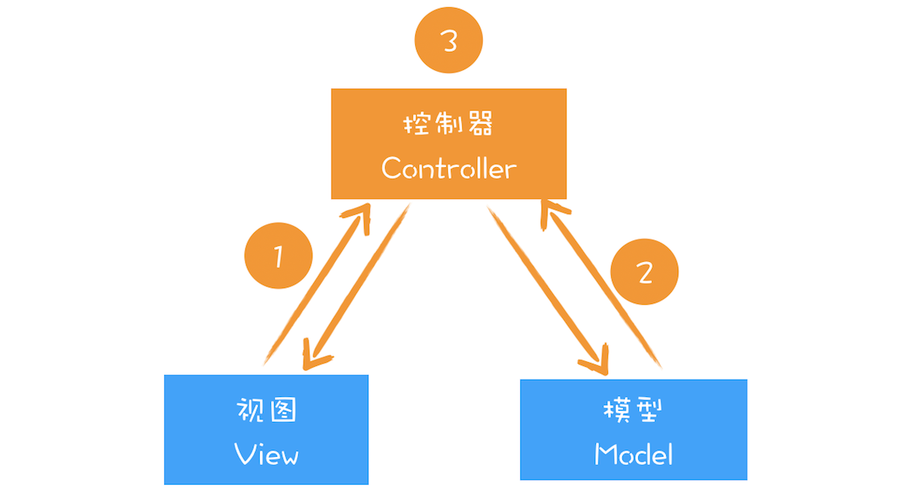

# 虚拟DOM：虚拟DOM和实际的DOM有何不同

## 什么是虚拟DOM
DOM要解决的事情：
- 将页面改变的内容应用到虚拟DOM上，而不是直接应用到DOM上
- 变化被应用到虚拟DOM上时，虚拟DOM并不急着去渲染页面，而仅仅是调整虚拟DOM的内部状态，这样操作虚拟DOM的代价就变得非常轻了
- 在虚拟DOM收集到足够的改变时，再把这些变化一次性应用到真实的DOM上  

  

虚拟DOM的运行过程： 

- **创建阶段**。首先依据JSX和基础数据创建出来虚拟DOM，它反映了真实的DOM树的结构，然后由虚拟DOM树创建出真实DOM树，真实的DOM树生成完后，再触发渲染流水线往屏幕输出页面
- **更新阶段**。如果数据发送改变，那么就需要根据新的数据创建一个新的虚拟DOM树；然后React比较两个树，找出变化的地方，并把变化的地方一次性更新到真实的DOM树上；最后渲染引擎更新渲染流水线，并生成新的页面

## 1.双缓存
使用双缓存，可以让你先将计算的中间结果存放在另一个缓冲区中，等全部的计算结果结束，该缓冲区以及存储了完整的图像后，再将该缓冲区的图形数据一次性复制到显示缓冲区，这样就使得图像的输出非常稳定。

## 2.MVC模式
  

**核心思想就是将数据和视图分离**  

  

该图中，我们可以把虚拟DOM看成是MVC的视图部分，其控制器和模型都是由Redux提供的  

- 图中的控制器是用来监控DOM的变化，一旦DOM发生变化，控制器便会通知模型，让其更新数据
- 模型数据更新好之后，控制器会通知视图，告诉它模型的数据发生了变化
- 视图接收到更新消息后，会根据模型所提供的数据来生成新的虚拟DOM
- 新的虚拟DOM生成好后，需要与之前的虚拟DOM进行比较，找出变化的节点
- 比较出变化的节点后，React将变化的虚拟节点应用到DOM上，这样就会触发DOM节点的更新
- DOM节点的变化又会触发后续一系列渲染流水线的变化，从而实现页面的更新