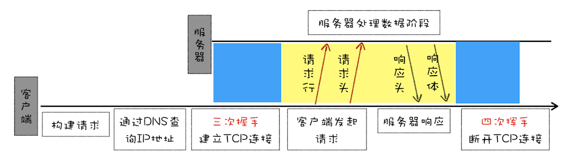

# HTTP/1:HTTP性能优化

## HTTP/1.0
**HTTP是浏览器和服务器之间的通信语言**  

请求流程：  

  


**通过请求头和响应头来支持多种不同类型的数据**    

请求头
```
//期望服务器返回的文件类型
accept: text/html
//压缩方式
accept-encoding: gzip, deflate, br
//文件编码
accept-Charset: ISO-8859-1,utf-8
//页面优先语言
accept-language: zh-CN,zh

```
响应头
```
content-encoding: br
content-type: text/html; charset=UTF-8

```

- 利用**状态码**告诉浏览器服务器的最终请求情况
- 提供**Cache机制**来缓存已经下载过的数据
- 在请求头中用**用户代理**字段来统计客户端的基础信息

## HTTP/1.1
### 1.改进持久连接
**在一个TCP连接上可以传输多个HTTP请求，只要浏览器或者服务器没有明确断开连接，那么该TCP连接会一直保持**   

  

有效减少TCP建立连接和断开连接的次数，减少服务器额外的负担，提升HTTP的请求时长  

默认开启，可在HTTP请求头中加上Connection:close来关闭。目前浏览器中对于同一个域名，默认允许同时建立6个TCP持久连接

### 2.不成熟的HTTP管线化
持久化需要等待前面的请求返回后，才能进行下一次请求，如果TCP管道中某个请求没能及时返回，会阻塞后面所有的请求。这就是**队头阻塞**

### 3.提供虚拟主机的支持
HTTP/1.1的请求头中增加了**Host字段**，用来表示当前的域名地址，这样服务器就可以根据不同的Host值做不同的处理

### 4.对动态生成的内容提供了完美支持
引进**Chunk transfer机制**，服务器将数据分割成若干个任意大小的数据块，每个数据块发送时会附上上个数据块的长度，最后使用一个零长度的块作为发送数据完成的标识。  
这样提供对动态内容的支持

### 5.客户端Cookie、安全机制