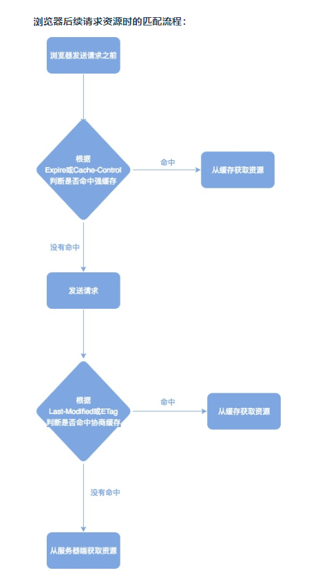

# HTTP缓存
  

  

浏览器第一次请求资源时，必须下载所有的资源，然后根据响应的header内容来决定，如何缓存资源  

1. 强缓存阶段：先在本地查找该资源，如果发现该资源，并且其他限制也没有问题(比如：缓存有效时间)，就命中强缓存，返回200，直接使用强缓存，并且不会发送请求到服务器
2. 弱缓存阶段：在本地缓存中找到该资源，发送一个http请求到服务器，服务器判断这个资源没有被改动过，则返回304，让浏览器使用该资源
3. 缓存失败阶段(重新请求)：当服务器发现该资源被修改过，或者在本地没有找到该缓存资源，服务器则返回资源的数据

## 强缓存
利用Expires或者Cache-Control，让原始服务器为文件设置一个过期时间  
若时间未过期，则命中强缓存，使用缓存文件不发送请求  

Cache-Control优先级高于Expires

### Cache-Control
1. 可缓存性：  

- public:服务器和浏览器端都能缓存
- private:只能浏览器端缓存
- no-cache:强制浏览器在使用cache拷贝前先提交一个http请求到源服务器进行确认。
- only-if-cached:表明客服端只接受已缓存的响应，并且不要向原始服务器检查是否有更新的拷贝
- max-age:设置缓存存储的最大周期

2. 其他设置
- no-store:不缓存，使用协商缓存
- must-revalidate:缓存必须在使用之前验证旧资源的状态，并且不可使用过期资源

```
Cache-Control:no-cache,no-store,must-revalidate
Cache-Control:public,max-age=31526000
Cache-Control:max-age=3600,must-revalidate
```

### Expires用于设置缓存到期时间
如果设了max-age,max-age会覆盖expires
```
Expires:Sat,09 Jun 2018 08:13:56 GMT
```

### Pragma禁止缓存
Pragma:no-cache表示防止客户端缓存，需要强制从服务器获取最新的数据
```
Pragma:no-cache
```


## 弱缓存
### Last-Modified & if-modified-since
last-modified是web服务器认为文件的最后修改时间，last-modified是第一次请求文件的时候，服务器返回的一个属性
```
Last-Modified: Sat, 09 Jun 2018 08:13:56 GMT 
```
第二次请求这个文件时，浏览器把If-Modified-Since发送给服务器，询问该时间之后文件是否被修改过
```
If-Modified-Since: Sat, 09 Jun 2018 08:13:56 GMT // 跟Last-Modified的值一样
```

### ETag & if-None-Match
ETag是一个文件的唯一标识符  

ETag也是首次请求的时候，服务器返回的
```
ETag: "8F759D4F67D66A7244638AD249675BE2" // 长这样
```
If-None-Match也是浏览器发送到服务器验证，文件是否改变的
```
If-None-Match: "8F759D4F67D66A7244638AD249675BE2" // 跟ETag的值一样
```
