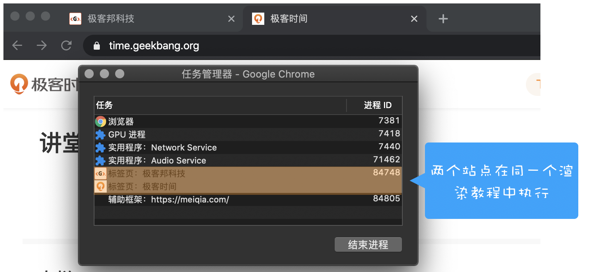
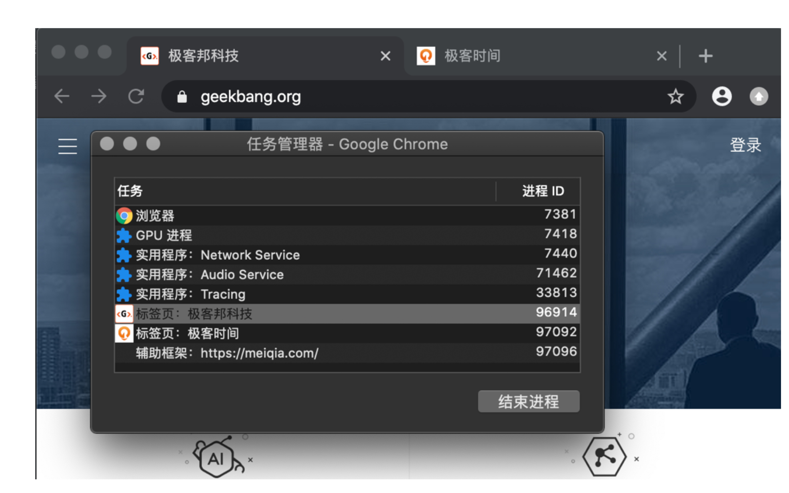
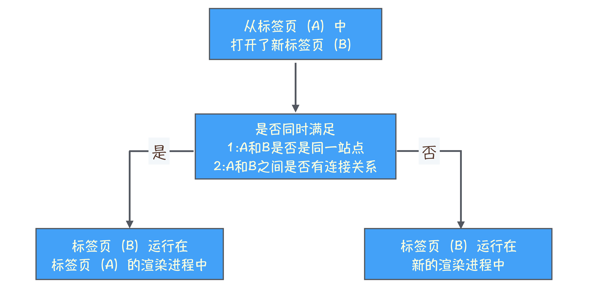
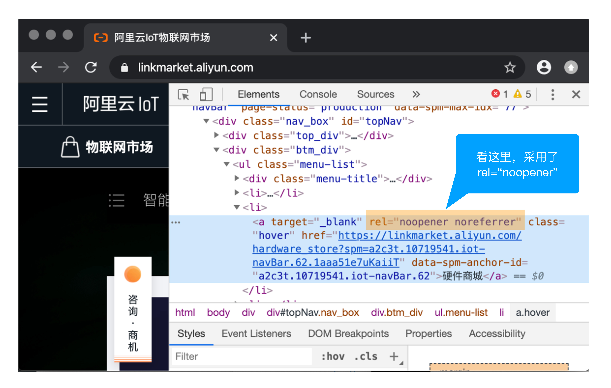
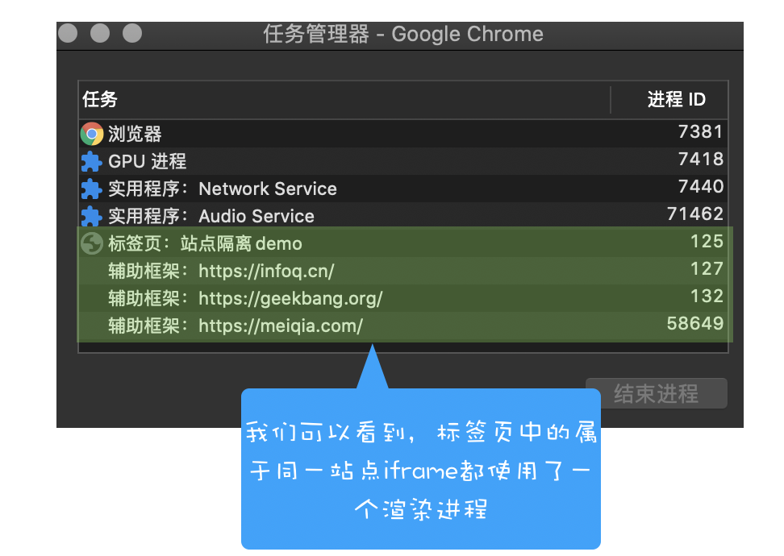
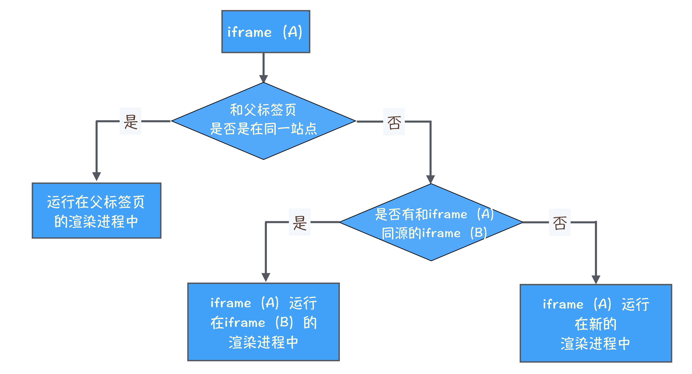

# 浏览上下文组：如何计算Chrome中渲染进程的个数
如果从极客邦(www.geekbang.org)的标签页中打开新的极客时间(time.geekbang.org)标签页，由于这两个标签页属于**同一站点(相同协议、相同根域名)**，所以他们会共用**同一个渲染进程**  

  

分别打开两个标签页  

   

## 标签页之间的连接
1. 通过\<a>标签来和新标签建立连接。  

```

<a  href="https://time.geekbang.org/" target="_black" class=""> 极客时间 </a>
```


1. 通过JS中的window.open方法来和新标签页建立连接  

```

new_window = window.open("http://time.geekbang.org")
```

上述两种方式打开的新标签页，不管是否属于同一站点，都可以通过**window.opener**来建立连接。  

在WhatWG规范中，把这一类具有相互连接关系的标签页称为**浏览上下文组(browsing context group)**  

通常情况下，我们把一个标签页所包含的内容，诸如window对象，历史记录，滚动条位置等信息称为**浏览上下文**  

通过脚本相互连接起来的浏览上下文就是浏览上下文组

#### Chrome浏览器会将浏览上下文组中属于同一站点的标签分配到同一个渲染进程中
这是因为如果一组标签页，既在同一个浏览上下文组中，又属于同一站点，则说明他们需要在对方的标签页中执行脚本。  

所以他们必须运行在同一渲染进程中  

  


## 一个例外
> https://linkmarket.aliyun.com/内新开一个标签页  

  

判断是否属于同一渲染进程：  

1. 首先验证这三个标签页是不是真的不在同一个浏览器上下文组中
2. 然后再分析他们为什么不在同一浏览上下文组  


可以通过查询标签页的**opener值**,如果是null,则说明B,C和A标签页没有连接关系，不属于同一浏览上下文组  

  

将noopener的值引入rel属性中，告诉浏览器通过这个链接打开的标签页中的opener值设置为null,引入noreferrer是告诉浏览器，新打开的标签页不要有引用关系。

## 站点隔离
如果标签页中的iframe和标签页是同一站点，并且有连接关系，那么标签页会和当前标签页运行在同一渲染进程中，如果iframe和标签页不属于同一站点，那么iframe会运行在单独的渲染进程中

```

<head>
    <title> 站点隔离:demo</title>
    <style>
        iframe {
            width: 800px;
            height: 300px;
        }
    </style>
</head>
<body>
    <div><iframe src="iframe.html"></iframe></div>
    <div><iframe src="https://www.infoq.cn/"></iframe></div>
    <div><iframe src="https://time.geekbang.org/"></iframe></div>
    <div><iframe src="https://www.geekbang.org/"></iframe></div>
</body>
</html>
```

  

由于InfoQ、极客邦两个iframe与父标签页不属于同一站点，所以会分配在不同的渲染进程。  

而iframe.html和源标签页属于同一站点，所以在同一进程。  



## 同源策略对同一站点的限制
Chrome会让**有连接**且**属于同一站点**的标签页运行在同一个渲染进程中  

但吴国不属于**同源站点**，则无法通过**opener**来操作父标签页中的DOM(time.geekbang.org和www.geekbang.org,则是属于同一站点但是不同源)
