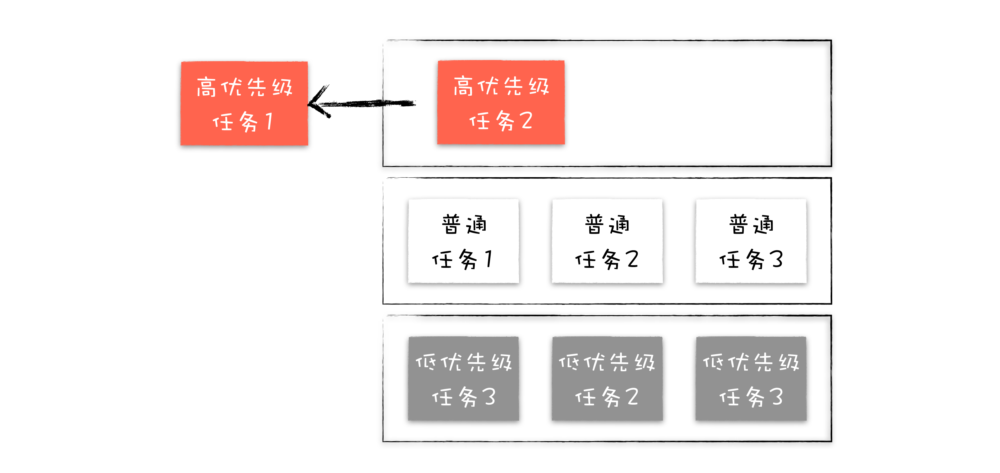
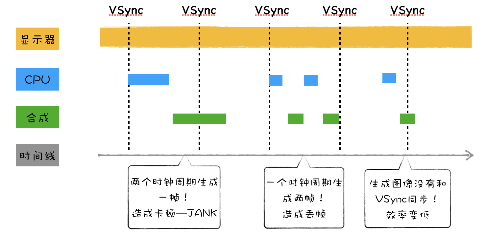
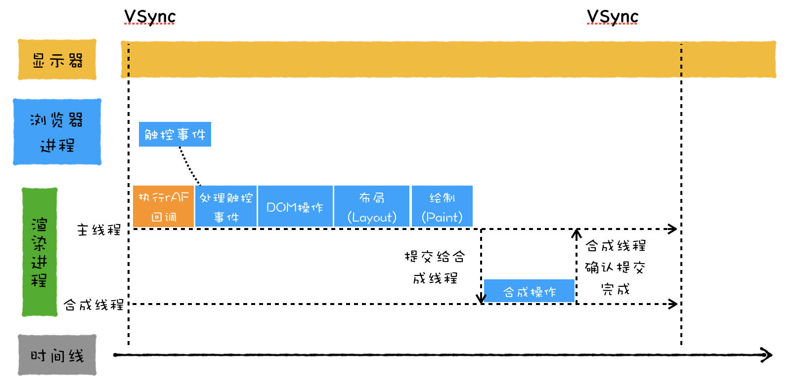

# 任务调度：有了setTimeout,为什么还要使用requestAnimationFrame
## 单消息队列的队头阻塞问题
> 渲染主线程会按照**先进先出**的顺序执行消息队列中的任务，当产生新的任务，渲染进程会将其添加到消息队列尾部，在执行任务过程中，渲染进程会顺序地从消息队列头部取出任务并依次执行。  

  

  

**在单消息队列架构下，存在着低优先级任务会阻塞高优先级任务的情况**

## Chromium是如何解决队头阻塞问题的
### 1.第一次迭代：引入一个高优先级队列
  

> 在渲染进程中引入一个**任务调度器**，负责从多个消息队列中选出合适的任务。  

  

> 不过大多数任务需要保持其**相对执行顺序**，如果将用户输入的消息或者合成消息添加进多个不同优先级的队列中，那么这种任务的相对执行顺序就会被打乱，甚至于有可能出现还未处理输入事件，就合成了该事件要显示的图片。

### 2.第二次迭代：根据消息类型来实现消息队列
  

> 虽然在交互阶段，采用上述这种静态优先级的策略没什么问题，但是在页面加载阶段，如果依然要优先执行用户输入事件和合成事件，那么页面的解析速度将会被拖慢。

### 3.第三次迭代：动态调度策略
  

- 在**页面加载阶段**，将页面解析、JS脚本执行等任务调整为优先级最高的队列，降低交互合成这些队列的优先级

#### 页面的渲染过程
> 在显卡中有一块叫做**前缓冲区**的地方，这里存放着显示器要显示的图像，显示器会按照一定的频率来读取这块前缓冲区，并将前缓冲区中的图像显示在显示器上，不同的显示器读取的频率是不同的，通常情况下是60HZ,也就是说显示器会每隔1/60秒就读取一次前缓冲区。  

> 如果浏览器要更新显示的图片，那么浏览器会将新生成的图片提交到显卡的**后缓冲区**中，提交结束后，GPU会将**后缓冲区和前缓冲区互换位置**。  

> 显示器从前缓冲区读取图片，和浏览器生成新的图像到后缓冲区的过程是**不同步的**  

  

- 如果渲染进程生成的帧速比屏幕的刷新率慢，那么屏幕会在两帧中显示同一个画面。
- 如果渲染进程生成的帧速率实际上比屏幕刷新率快，GPU所渲染的图像并非全部被显示出来，这就会造成丢帧现象。
- 就算屏幕的刷新频率和GPU更新图片的频率一样，由于它们是不同的系统，所以屏幕生成帧的周期和VSync的周期也是很难同步起来的。  

**为了解决这些问题，需要将显示器的时钟同步周期和浏览器生成页面的周期绑定起来。**  

当显示器将一帧画面绘制完成后，并在准备读取下一帧之前，显示器会发出一个垂直同步信号(vertical synchronization)给GPU,简称**VSync**  

当**GPU**接收到VSync信号后，会将VSync信号同步给**浏览器进程**，浏览器进程再将其同步到对应的**渲染进程**，渲染进程接收到VSync信号之后，就可以准备绘制新的一帧了。  

  

### 4.第四次迭代：任务饿死
> 在某个状态下，一直有新的高优先级的任务加入到队列中，这样就会导致其他低优先级的任务得不到执行，这称为**任务饿死**  

Chromium为了解决任务饿死的问题，给每个队列设置执行权重，如果连续执行了一定个数的高优先级的任务，那么中间会执行一次低优先级的任务，这样就缓解了任务饿死的情况。