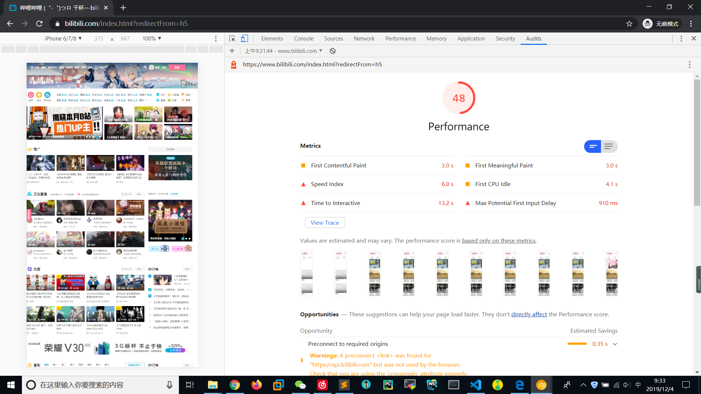
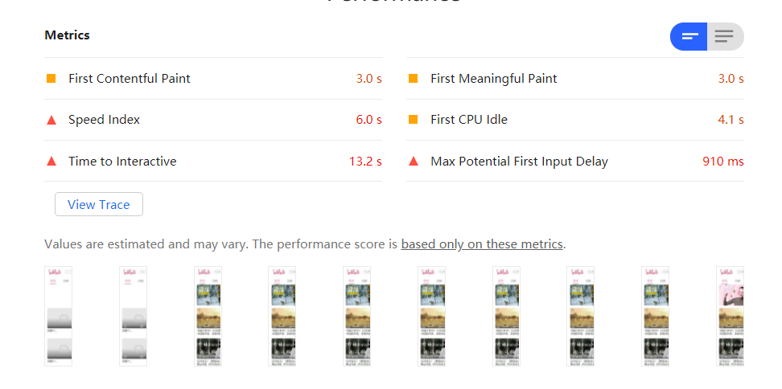
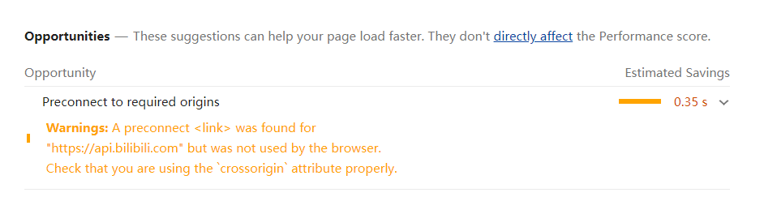
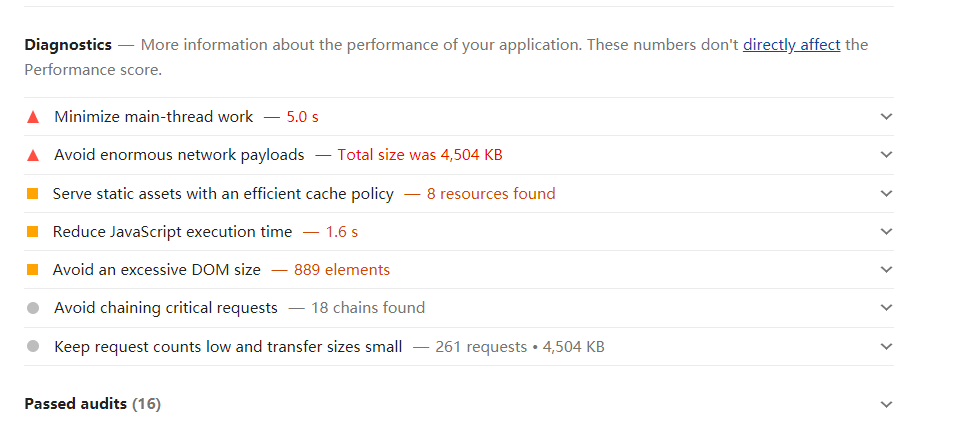
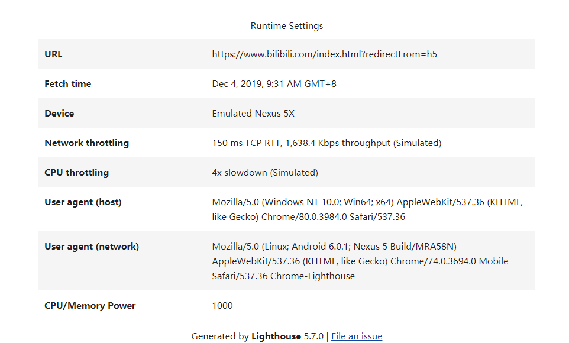

# 3.加载阶段，使用Audits来优化web性能
**Web性能**  

- 页面加载阶段
- 页面交互阶段

## 性能检测工具：Performance VS Audits
### 利用Audits生成Web性能报告
COntrol+Shift+N进入浏览器的隐身窗口  

Audits配置模块：  
- 监测类型(Categories)
- 设备类型(Device)  

#### 监控类型
- web性能(Performance)
- PWA(Progressive Web App)程序的性能
- Web应用是否采用了最佳实践策略(Best practices)
- 是否实施了无障碍功能(Accessibility)
- web是否实施了SEO搜索引擎优化(SEO)

### 解读性能报告
  

- 中间圆圈中的数字表示该站点在加载过程中的总体web性能得分  

#### 性能指标

#### 可优化项

#### 手动诊断

#### 运行时设置

### 根据性能报告优化Web性能
1. 首次绘制(First Paint)
2. 首次有效绘制(First Meaningfull Paint)
3. 首屏时间(Speed Index)
4. 首次CPU空闲时间(First CPU Idle)
5. 完全可交互时间(Time to Interactive)
6. 最大估计输入延时(Max Potential First Input Delay)  

  

- 在渲染进程确认要渲染当前的请求后，渲染进程会创建一个空白页面，这个时间点称为**First Paint(FP)**
- **First Content Paint(FCP)**:js等关键资源加载完成后，渲染进程执行脚本，脚本修改DOM,引发重绘和重排等，页面中**绘制第一个像素的时间点**
- FMP:首次有效绘制
- **Largest Content Paint(LCP):**执行JS脚本，**首屏内容完全绘制完成的时间点**
- JS脚本执行结束,DOM生成完毕,触发DOMContentLoad事件，等所有资源都加载结束后，再触发onload事件

### 性能6项指标
1. FB时间过久：页面的HTML文件由于网络原因导致加载时间过久
2. FMP和LCP时间过久：关键资源加载过久，JS执行过程所花时间过久
3. 首次CPU空闲时间：表示页面达到最小化可交互的时间，跟关键资源的加载有关
4. 完全可交互时间：页面中所有元素都达到可交互时长，如果时间过长可以推迟执行一些和生成页面无关的JS工作
5. 最大估计输入延时：估计web页面在加载最繁忙的阶段，窗口中响应用户输入所需的时间。改善方法，使用WebWorker释放主线程、重构CSS选择器减少计算操作