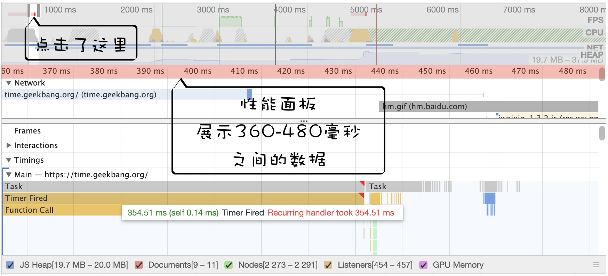
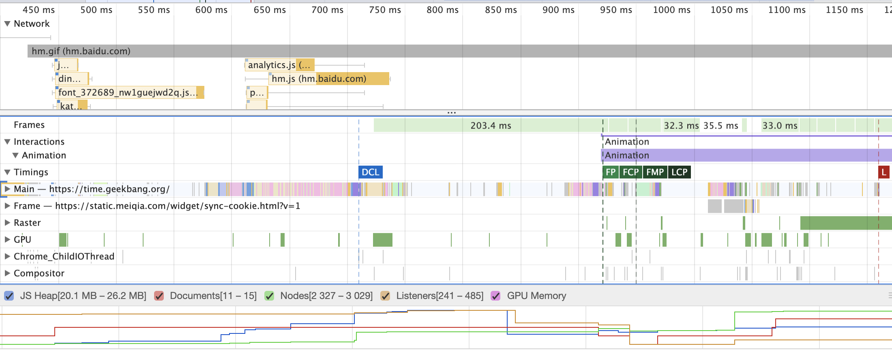
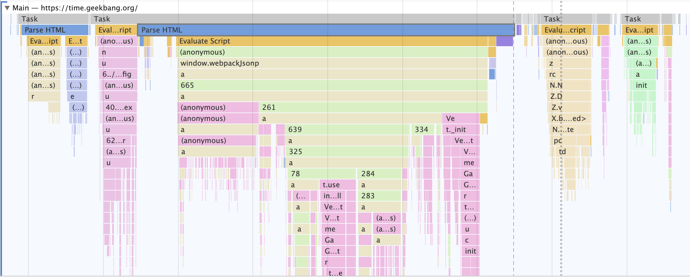
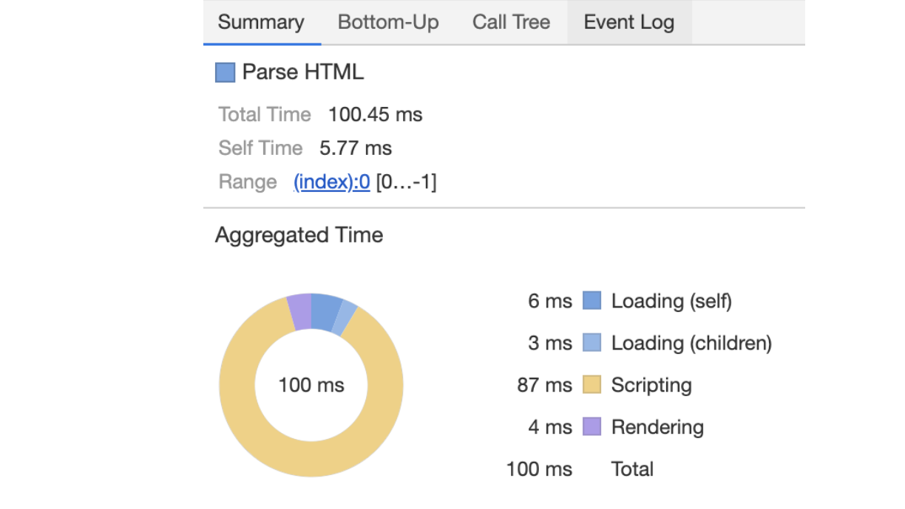

# 页面性能工具：如何使用Performance
> Performance可以记录站点在运行过程中的性能数据，将采集到的数据按照时间线的方式展示。  

1. 配置Performance
2. 生成报告页
3. 人工分析报告页，找出页面的性能瓶颈  

## 配置Performance
  

1. 区域1中  
   1. **Network**:限制网络加载速度
   2. **CPU**:限制CPU的运算速度  

上面的设置是把CPU的运算能力降低到1/6，网络加载速度设置为‘快的3G(Fast 3G)’  

2. 区域2、3
   1. 黑色按钮：记录**交互阶段**性能数据
   2. 带箭头的圆圈形按钮：记录**加载阶段**的性能数据  

- 录制加载阶段的性能数据时，Performance会重新刷新页面，并等到页面完全渲染出来后，Performance就会自动停止录制
- 录制交互阶段的性能时，需要手动停止录制过程

## 认识报告页
  

- 浏览面板
- 性能指标面板
- 详情面板

### 1.浏览面板
> 引入了时间线，Performance就会将几个关键指标，诸如页面帧速(FPS)、CPU资源消耗、网络请求流量、V8内存使用量(堆内存)等，按照时间顺序做成图表的形式展示出来，这就是浏览面板    

- 如果FPS图表上出现了红色块，那么就表示红色块附近渲染出一帧所需时间过久，帧的渲染时间过久，就有可能导致页面卡顿
- 如果CPU图形占用面积太大，表示CPU使用率就越高，那么就有可能因为某个JS占用太多的主线程时间，从而影响其他任务的执行
- 如果V8的内存使用量一直在增加，就有可能是某种原因导致了内存泄露

### 2.性能面板
- **Main指标**记录**渲染主线程**的任务执行过程
- **Compositor指标**记录了**合成线程**的任务执行过程
- **GPU指标**记录了**GPU进程主线程**的任务执行过程  

**通过浏览面板来定位问题的时间节点，然后再使用性能面板分析该时间节点内的性能数据**  

### 3.解读性能面板的各项指标
**性能面板用来展示特定时间段内的多种性能指标数据**

#### 渲染流水线
> 渲染流水线：渲染模块在执行渲染的过程中会被划分为很多子阶段，输入的HTML数据经过这些子阶段，最后输出屏幕上的像素  

解析HTML文件生成DOM > 解析CSS生成CSSOM > 执行JS > 样式计算 > 构造布局树 > 准备布局树 > 准备绘制列表 > 光栅化 > 合成 > 显示  

  

#### Main指标
在渲染主线程上执行的所有记录都可以通过Main指标来查看，你可以通过点击Main来展开主线程的任务执行记录  

  

- 一段段横条代表执行一个个任务，长度越长，花费的时间越多
- 竖向代表该任务的执行记录  

#### Compositor指标
监控合成线程的任务执行记录

#### Raster指标和GPU指标
GPU生成位图的过程称为**光栅化**，如果合成线程直接和GPU进程进行通信，那么会阻塞后面的合成任务，因此合成线程又维护一个**光栅化线程池(Raster)**，用来让GPU执行光栅化的任务

#### Chrome_ChildIOThread指标
IO线程的任务记录

#### Network指标
网络记录展示了页面中的每个网络请求所消耗的时长，并以瀑布流的形式展示

#### Timings指标
用来记录一些关键的时间节点在何时产生的数据信息

#### Frames指标
浏览器生成的每帧的记录

#### Interactions指标
用来记录用户交互操作

### 4.详情面板

