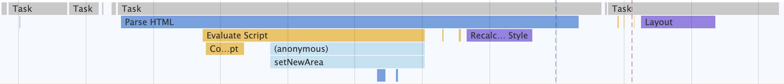

# 5.分析Performance中的Main指标
Main指标就记录**渲染主线**上所执行的全部**任务**，以及每个**任务**的详细**执行过程**  

  

- 灰色横条：对应一个任务，长度对应任务的执行时长
- 灰线下面的横条：任务执行过程中关键细节(**任务的过程**)  

  

你可以把**任务**看成一个Task函数，在执行Task函数的过程中，它会调用一系列的子函数，这些子函数就是我们提到的**过程**

```
function A(){
    A1();
    A2();
}

function Task(){
    A();
    B();
}

Task()
```

## 分析页面加载过程
```

<html>
<head>
    <title>Main</title>
    <style>
        area {
            border: 2px ridge;
        }


        box {
            background-color: rgba(106, 24, 238, 0.26);
            height: 5em;
            margin: 1em;
            width: 5em;
        }
    </style>
</head>


<body>
    <div class="area">
        <div class="box rAF"></div>
    </div>
    <br>
    <script>
        function setNewArea() {
            let el = document.createElement('div')
            el.setAttribute('class', 'area')
            el.innerHTML = '<div class="box rAF"></div>'
            document.body.append(el)
        }
        setNewArea()   
    </script>
</body>
</html>
```

  

1. 导航阶段，该阶段主要是从网络进程接收HTML响应头和HTML响应体
2. 解析HTML数据阶段，该阶段主要是将接收到的HTML数据转换为DOM和CSSOM
3. 生成可显示的位图阶段，该阶段主要利用DOM和CSSOM,经过计算布局、生成层树(LayerTree)、生成绘制列表(Paint)、完成合成等操作，生成最终的图片。

### 导航阶段
  

当你点击重新加载按钮后，当前的页面会执行上图中的这个任务：  

- 该任务的第一个子过程就是**Send request**,该过程表示网络请求已被发送。然后该任务进入了等待状态。
- 接着由网络进程负责下载资源，当接收到响应头的时候，该任务便执行**Receive Response过程**，该过程表示接收到HTTP的响应头了
- 接着执行**DOM事件**:pagehide、visibilitychange和unload等事件，如果你注册了这些事件的回调函数，那么这些回调函数会依次在该任务中被调用
- 这些事件被处理完成之后，就接收HTML数据，即**Recive Data过程**，Revice Data过程表示请求的数据已被接收，如果HTML数据过多，会存在多个Receive Data过程
- 等所有数据都接收完成之后，渲染进程会触发另外一个任务，该任务主要执行**Finish load过程**，该过程表示网络请求已经完成

### 解析HTML数据阶段
> 通过解析HTML数据、解析CSS数据、执行JS来生成DOM和CSSOM  

  

#### HTMLParser
解析上个阶段接收到的HTML数据  

1. 解析到script标签，进入脚本执行过程，即**Evalute Script**
2. **脚本编译过程(Compile Script)**
3. **程序执行过程：**anonymous过程、setNewArea过程、createElement、document.append方法，触发DOM内容修改，强制执行ParserHTML过程生成的新的DOM
4. DOM生成后触发相关的DOM事件
5. Reculate Style(生成CSSOM)

### 生成可显示位图阶段
> 布局、分层、绘制、合成  

  

1. 执行布局(Layout)
2. 更新层树(Update LayerTree)
3. 绘制列表(Paint)
4. 生成相应图层的位图(Composite Layers)

### 主线程结束后，将合成任务交给合成线程
  

1. 合成线程的执行记录通过**Compositor指标**查看
2. 合成线程维护一个**Raster线程池**，线程池中的每个线程称为**Rasterize**,用来执行光栅化操作，对应的任务就是**Rasterize Paint**
3. 光栅化操作在GPU进程中执行，所以Rasterize线程需要和GPU线程保持通信
4. GPU生成图像，图层交给浏览器进程，将其合成并最终呈现在页面上