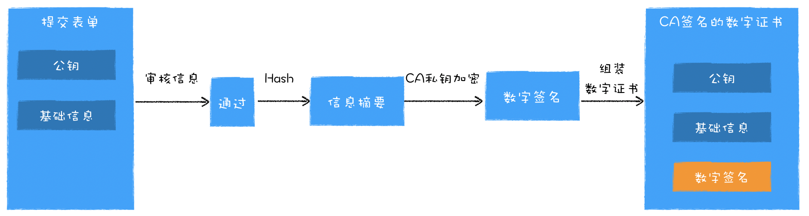
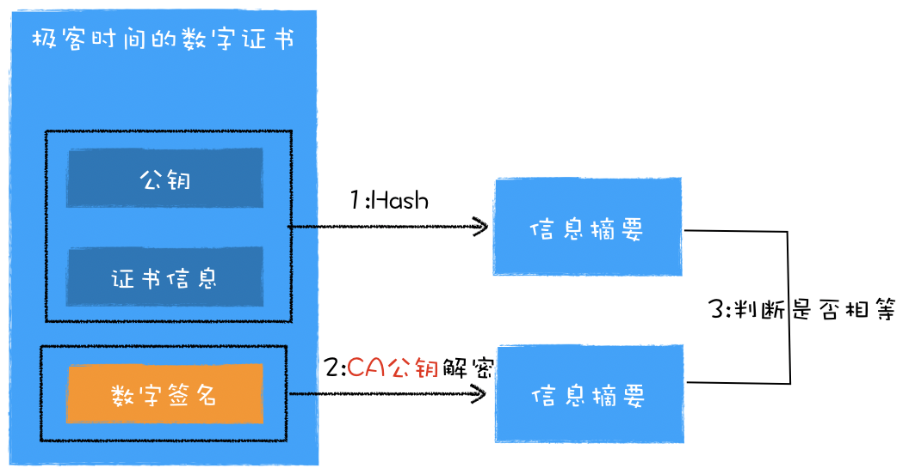
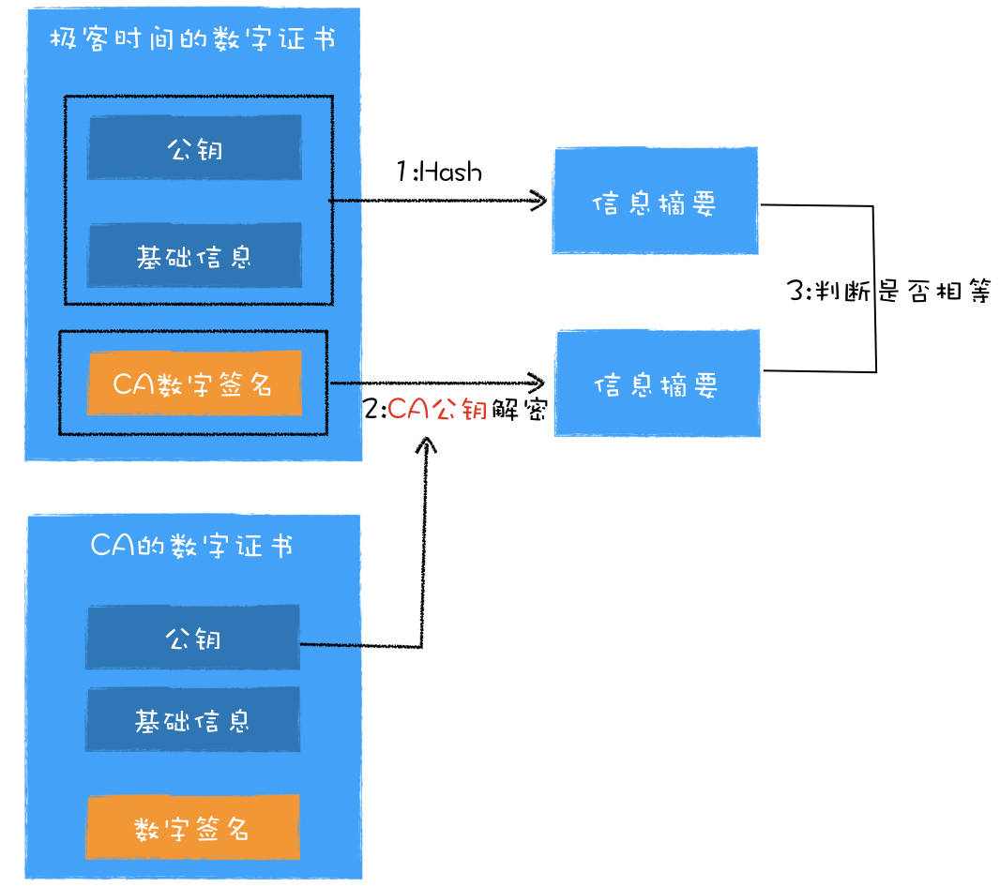
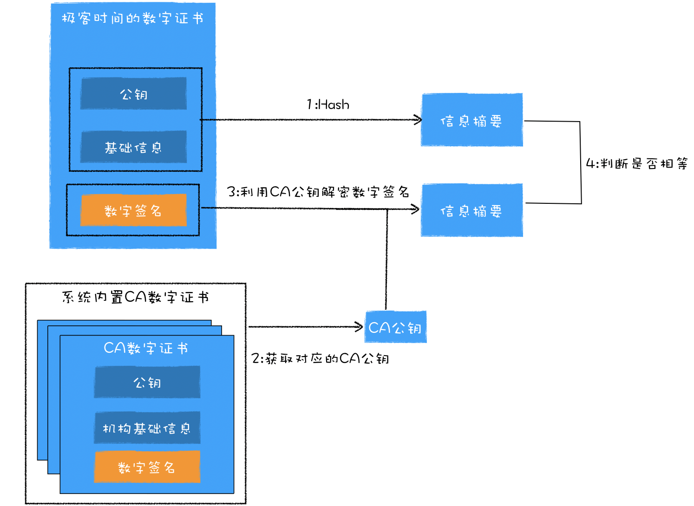

# HTTPS:浏览器如何验证数字证书
- HTTPS使用了对称和非对称的混合加密方式，解决了数据传输安全的问题
- HTTPS引入了中间机构CA,CA通过给服务器颁发数字证书，解决了浏览器对服务器的信任问题

## 数字证书申请流程

## 浏览器验证证书的流程
1. 验证证书的有效期
2. 验证数字证书是否被吊销
3. 验证数字证书是否是CA机构颁发的  
   1. 浏览器利用证书的原始信息计算出信息摘要
   2. 利用CA的**公钥**来解密数字证书中的**数字签名**，解密出来的数据也是信息摘要
   3. 判断这两个信息摘要是否相等  

## 浏览器是怎样获取到CA公钥的
网站服务器部署HTTP服务器时有两个数字证书  
- 给网站域名的数字证书
- 给网站签名的CA机构的数字证书  

在建立HTTPS链接时，服务器会将这两个证书一同发送给浏览器，于是浏览器就获取到了CA的公钥了  

## 证明CA机构的合法性
很难直接证明，最好在操作系统中内置CA机构的数字证书  

  

## 数字证书链
通常申请者都是向**中间CA**去申请证书的，而**根CA**作用就是给中间CA做认证，一个根CA会认证很多中间的CA，而这些中间CA又可以去认证其他的中间CA  

## 如何验证根证书的合法性
判断这个根证书在不在操作系统中