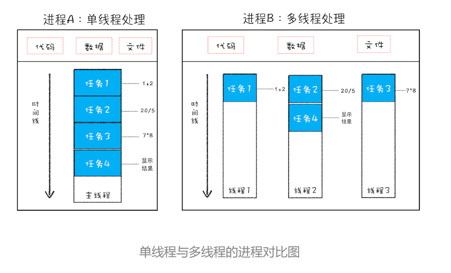

# Chrome架构：仅仅打开了1个页面，为什么有4个进程？
## 线程和进程
线程是不能单独存在的，它是由进程来启动和管理的。  
**一个进程就是一个程序的运行实例。**  
启动一个程序的时候，操作系统会为该程序创建一块内存，用来存放代码、运行中的数据和一个执行任务的主线程，这样的一个运行环境叫做**进程**     

   

### 进程和线程之间的关系
1. 进程中的任意一线程执行出错，都会导致整个进程的崩溃
2. 线程之间共享进程中的数据
3. 当一个进程关闭之后，操作系统会回收进程所占用的内存
4. 进程之间的内容相互隔离

## 目前多进程架构
  
  
  - 浏览器进程。主要负责界面显示、用户交互、子进程管理，同时提供存储等功能。
  - 渲染进程。核心任务是将 HTML、CSS 和 JavaScript 转换为用户可以与之交互的网页，排版引擎Blink和JS引擎V8都是运行在该进程中，默认情况下，Chrome会为每个Tab标签创建一个渲染进程。出于安全考虑，渲染进程都是运行在沙箱模式下。
  - GPU进程。为了实现3D CSS的效果，网页、Chrome的UI界面都采用GPU来绘制。
  - 网络进程。主要负责页面的网络资源加载。
  - 插件进程。主要是负责插件的运行，因插件容易崩溃，所以需要通过插件进程来隔离，以保障插件进程崩溃不会对浏览器和页面造成影响。