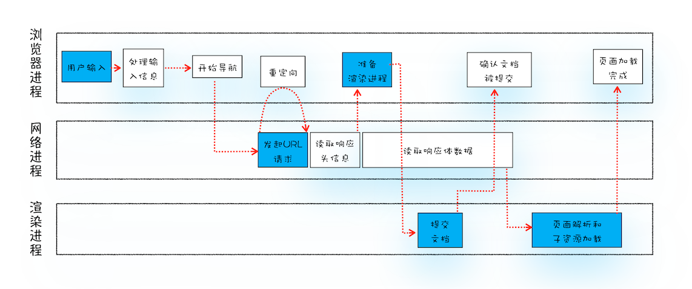

# 导航流程：从输入URL到页面展示，这中间发生了什么？
  
  
- 浏览器进程主要负责用户交互、子进程管理和文件存储等功能。
- 网络进程是面向渲染进程和浏览器进程等提供网络下载功能。
- 渲染进程的主要职责是把从网络下载的HTML、CSS、JavaScript、图片等资源解析为可以显示和交互的界面。

## 导航
- 用户从浏览器进程里输入请求信息
- 网络进程发起URL请求
- 服务器响应URL请求后，浏览器进程开始准备渲染进程
- 先渲染进程提交页面数据（提交文档阶段）
- 渲染进程开始解析页面和加载子资源

## 从输入URL到页面展示
- 用户输入
- URL请求过程
  - 重定向
  - 响应数据类型处理
- 准备渲染过程
- 提交文档
- 渲染阶段

### 1.用户输入
- 关键字为搜索内容
- 关键字为请求的URL

### 2.URL请求过程
- 网络进程查看本地缓存是否有该资源
- 网络请求流程
  - DNS解析
  - 利用IP地址和服务器建立TCP连接
  - 浏览器构建请求头
  - 向服务器发送构建的请求信息
- 服务器生成响应信息，发送
- 网络进程解析响应头

1. 重定向  

响应头中的状态码是301或302,则需要重定向到其他URL(Location字段提供地址)  

2.响应数据类型处理  
**Content-Type**是HTTP头中一个字段，它告诉浏览器服务器返回的响应体数据是什么类型。  
然后浏览器根据Content-Type来决定显示响应体的内容。  
   
### 3.准备渲染进程
打开一个新页面采用的**渲染进程策略**：
- 通常情况下，打开新的页面都会使用单独的渲染进程
- 如果从A页面打开B页面，且A和B都属于**同一站点**的话，那么B页面复用A页面的渲染进程；如果是其他情况，浏览器进程则会为B创建一个新的渲染进程。

同一站点：相同的协议和根域名
```
https://time.geekbang.org
https://www.geekbang.org
https://www.geekbang.org:8080
```

### 4.提交文档
文档指的是**URL请求的响应体数据**  
  
- “提交文档”的消息是由浏览器进程发出的，渲染进程接收到“提交文档”的消息后，会和网络进程建立传输数据的“管道”
- 等文档数据传输完成后，渲染进程会返回“确认提交”的消息给浏览器进程
- 浏览器进程在收到“确认提交”的消息后，会更新浏览器界面状态，包括安全状态、地址栏的URL、前进后退的历史状态，并更新Web界面


### 5.渲染阶段