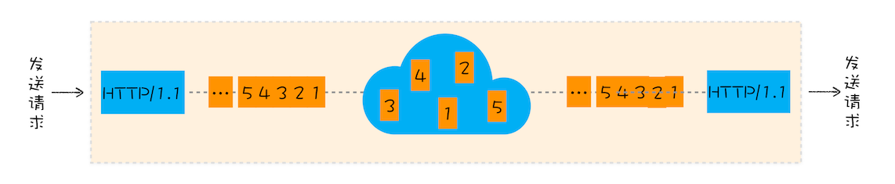

# HTTP/3:甩掉TCP、TLS的包袱，构建高效网络

## TCP的队头阻塞
  

  

**在TCP传输过程中，由于单个数据包的丢失而造成的阻塞称为TCP上的队头阻塞**  

HTTP/2多路复用  
  

在HTTP/2中，多个请求是跑在一个TCP管道中的，如果其中任意一路数据流中出现了丢包的情况，那么就会阻塞该TCP连接中的所有的请求。而HTTP/1.1中，浏览器为每个域名开启了6个TCP连接，如果其中的1个TCP连接发送了队头阻塞，那么其他的5个连接依然可以传输数据。

## TCP建立连接的延时
我们把从浏览器发送一个数据包到服务器，再从服务器返回数据包到浏览器的整个往返时间称为RTT(Round Trip Time),即网络延迟  

## TCP协议僵化

如果我们在客户端升级了TCP协议，但是当新协议的数据包经过这些中间设备(路由器、防火墙、NAT、交换机等)———很少升级、设置后很少更新，它们可能不理解包的内容，于是这些数据就会被丢弃掉。这就是**中间设备僵化**  

**操作系统也是导致TCP协议僵化的一个原因**。因为TCP协议是通过操作系统内核来实现的，应用程序只能使用不能修改。而通常操作系统的更新都滞后于软件大的更新，因此很难更新内核中的TCP协议

## QUIC协议
为解决HTTP/2中TCP协议僵化等问题  

HTTP/3使用**UDP协议**，即基于UDP实现了类似于TCP的多路数据流、传输可靠性等功能，这套协议称为**QUIC协议**  

  

- **实现了类似于TCP的流量控制、传输可靠性的功能**。QUID在UDP的基础上增加一层来保证数据可靠性传输，提供了数据包重传、拥塞控制以及其他TCP中存在的特性
- **集成了TLS加密功能**。减少了握手所花费的RTT个数
- **实现了HTTP/2中的多路复用功能**。QUIC实现了在同一物理连接上可以有多个**独立的逻辑数据流**。实现数据流的单独传输，解决了TCP中队头阻塞的问题  
  

- **实现了快速握手功能**。由于QUIC是基于UDP的，所以QUIC可以实现使用0-RTT或者1-RTT来建立连接，这意味着QUIC可以用最快的速度来发送和接收数据，这样就提高了首次打开页面的速度