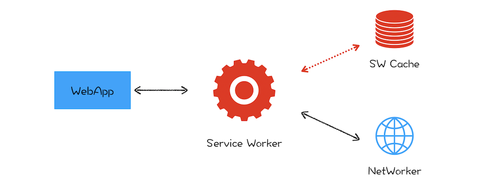

#  渐进式网页应用(PWA):它究竟解决了Web应用的哪些问题

**PWA提出了两种解决方案：通过引入Service Worker来试着解决离线存储和消息推送的问题，通过引入manifest.json来解决一级入口的问题**

## Service Worker
**在页面和网络之间增加一个拦截器，用来缓存和拦截请求**  

  

在没有安装Service Worker之前，WebApp都是直接通过网络模块来请求资源的。安装了Service Worker模块之后，WebApp请求资源时，会先通过Service Worker，让它判断是返回Service Worker缓存的资源还是重新去网络请求资源。一切控制权都交由Service Worker处理

## Service Worker的设计思路
Service Worker的主要功能就是**拦截请求**和**缓存资源**

### 1.架构
Service Worker在Web Worker(**运行在主线程之外**)的基础之上加上**存储功能**  

Service Worker是运行在**浏览器进程**中的，因为浏览器进程生命周期是最长的，所以在浏览器的生命周期内，能够为所有的页面提供服务。

### 2.消息推送
浏览器没有启动时，需要Service Worker来接收服务器推送的消息，并展示给用户

### 3.安全
HTTP采用的是明文传输信息，存在被窃听、被篡改和被劫持的风险。  

Service Worker采用HTTPS协议，通信数据经过加密，有校验机制，可知道数据是否被篡改。