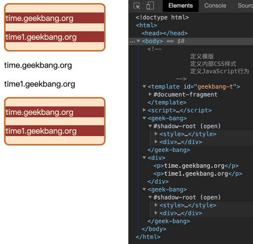

# WebComponent:像搭积木一样构建Web应用

组件化：**对内高聚合，对外低耦合**。对内各个元素彼此紧密结合、相互依赖，对外和其他组件的联系最少且接口简单

## 阻碍前端组件化的因素
渲染引擎会将所有的CSS内容解析为CSSOM,在生成布局树的时候，会在CSSOM中为布局树中的元素查找样式，所以有两个相同标签最终所显示出来的效果是一样的，渲染引擎是不能为他们分别单独设置样式的。  
DOM也是阻碍组件化的一个因素，因为页面中只有一个DOM,任何地方都可以直接读取和修改DOM.

## WebComponent组件化开发
WebComponent提供了对**局部视图封装能力**，可以让DOM、CSSOM和JS运行在局部环境中，这样就使得局部的CSS和DOM不会影响到全局  

WebComponent是一套技术组合  
- Custom elements(自定义元素)
- Shadow DOM(影子DOM)
- HTML templates(HTML模板)

```
<!DOCTYPE html>
<html>


<body>
    <!--
            一：定义模板
            二：定义内部 CSS 样式
            三：定义 JavaScript 行为
    -->
    <template id="geekbang-t">
        <style>
            p {
                background-color: brown;
                color: cornsilk
            }


            div {
                width: 200px;
                background-color: bisque;
                border: 3px solid chocolate;
                border-radius: 10px;
            }
        </style>
        <div>
            <p>time.geekbang.org</p>
            <p>time1.geekbang.org</p>
        </div>
        <script>
            function foo() {
                console.log('inner log')
            }
        </script>
    </template>
    <script>
        class GeekBang extends HTMLElement {
            constructor() {
                super()
                // 获取组件模板
                const content = document.querySelector('#geekbang-t').content
                // 创建影子 DOM 节点
                const shadowDOM = this.attachShadow({ mode: 'open' })
                // 将模板添加到影子 DOM 上
                shadowDOM.appendChild(content.cloneNode(true))
            }
        }
        customElements.define('geek-bang', GeekBang)
    </script>


    <geek-bang></geek-bang>
    <div>
        <p>time.geekbang.org</p>
        <p>time1.geekbang.org</p>
    </div>
    <geek-bang></geek-bang>
</body>


</html>


```
- Element.attachShadow()方法给指定的元素挂载一个Shadow DOM，并且返回它的ShadowRoot
- Node.cloneNode()方法返回调用该方法的节点的一个副本。true为采用深度克隆，false则只克隆该节点本身
- CustomElements是用来获取使用CustomElementRegistry.define()方法定义和注册的自定义元素
  

1. **使用template属性来创建模板**
2. **创建一个GeekBang的类**。在该类的构造函数中要完成三件事：  
   - 查找模板内容
   - 创建影子DOM
   - 再将模板添加到影子DOM上

3. 像正常使用HTML元素一样使用该元素  

```
<geek-bang></geek-bang>
```

### 影子DOM
**作用是将模板中的内容与全局DOM和CSS进行隔离**，这样我们就可以实现元素和样式的私有化。  

可以把影子DOM看成一个作用域，其内部的样式和元素是不会影响到全局的样式和元素的，而在全局环境下，要访问影子DOM内部的样式或元素就需要通过**约定好的接口**  

  

通过影子DOM可以隔离CSS和DOM,不过影子DOM的JS脚本是不会被隔离的，即外部可以访问其JS函数

## 浏览器如何实现影子DOM
1. 影子DOM中的元素对于整个网页是不可见的
2. 影子DOM的CSS不会影响到整个网页的CSSOM，影子DOM内部的CSS只对内部的元素起作用

