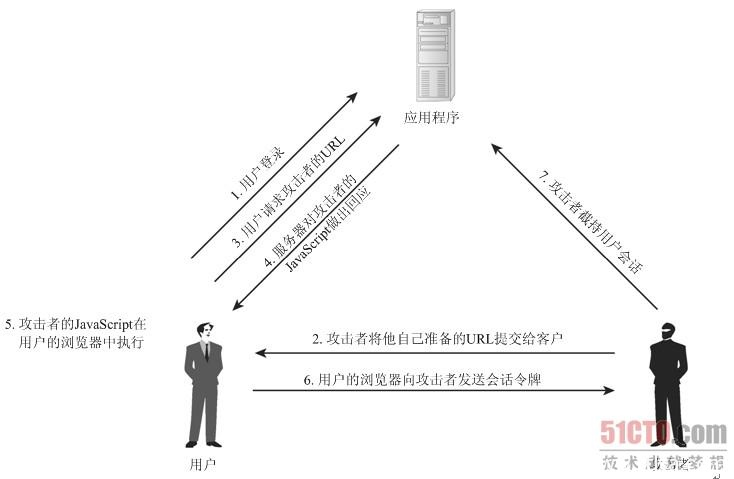

# 跨站脚本攻击(XSS):为什么Cookie中有HttpOnly属性
XSS(Cross Site Scripting)攻击是指黑客往**HTML文件**中或者**DOM**中**注入恶意脚本**，从而在用户浏览页面时利用注入的恶意脚本对用户实施攻击的一种手段  

- **窃取Cookie信息**。恶意JS通过“document.cookie”获取Cookie信息，然后通过XMLHttpRequest或者Fetch加上CORS功能将数据发送给恶意服务器
- **监听用户行为**。恶意JS可以使用“addEventListener“接口来监听键盘事件。
- **修改DOM**伪造假的登录窗口
- **在页面内生成浮窗广告**

## 恶意脚本是怎么注入的
通常情况下，主要有**存储型XSS攻击**、**反射型XSS攻击**和**基于DOM的XSS攻击**三种方式来注入恶意脚本

### 1.存储型XSS攻击
  

- 首先黑客利用站点漏洞将一段恶意JS代码提交到网站的数据库中
- 然后用户向网站请求包含了恶意JS脚本的页面
- 当用户浏览该页面的时候，恶意脚本就会将用户的Cookie信息等数据上传到服务器

### 2.反射型XSS攻击


### 3.基于DOM的XSS攻击
不涉及页面的web服务器，将恶意脚本注入用户的页面中，在Web资源传输过程或者在用户使用页面的过程中修改Web页面的数据

## 如何阻止XSS攻击
要阻止XSS攻击，可以通过阻止恶意JS脚本的注入和恶意消息的发送来实现

### 1.服务器对输入脚本进行过滤或转码

### 2.充分利用CSP
CSP有如下几个功能：  
- 限制加载其他域下的资源文件，这样即使黑客插入一个JS文件，这个JS文件也是无法被加载的
- 禁止向第三方域提交数据，这样用户数据也不会泄漏
- 禁止执行内联脚本和未授权的脚本
- 提供了上报机制，这样可以帮助我们尽快发现有哪些XSS攻击，以便尽快修复问题

### 3.使用HttpOnly属性
通常服务器可以将某些Cookie设置为**HttpOnly标志**
```
set-cookie: NID=189=M8q2FtWbsR8RlcldPVt7qkrqR38LmFY9jUxkKo3-4Bi6Qu_ocNOat7nkYZUTzolHjFnwBw0izgsATSI7TZyiiiaV94qGh-BzEYsNVa7TZmjAYTxYTOM9L_-0CN9ipL6cXi8l6-z41asXtm2uEwcOC5oh9djkffOMhWqQrlnCtOI; expires=Sat, 18-Apr-2020 06:52:22 GMT; path=/; domain=.google.com; HttpOnly

```
set-cookie属性值最后使用了HttpOnly来标记该Cookie  

HttpOnly是服务器通过HTTP响应头来设置的，使用HttpOnly标记的Cookie只能使用在HTTP请求过程中，所以无法通过JS来读取这段Cookie  

  

由于JS无法读取设置了HttpOnly的Cookie数据，所以即使页面被注入了恶意Js脚本，也是无法获取到设置了HttpOnly的数据。
